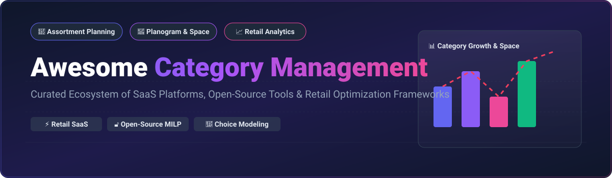

<p align="center">
  <a href="https://github.com/ishandutta2007/Awesome-Awesome-Awesome"></a>
  <a href="https://discord.gg/jc4xtF58Ve"></a>
  
  
  
  
  <a href="https://github.com/ishandutta2007"></a>
</p>

# 🛒 Awesome Category Management 📊



> 🚀 **Curated List of SaaS Platforms, Open-Source GitHub Projects & Retail Optimization Frameworks**
> 
> *Focused on Assortment Planning, Planogram Optimization, Space Management, Visual Merchandising & Retail Analytics.*

---

## 📌 Executive Summary & Market Insights

> **Market Size & Fragmentation:** The global Category Management & Retail Space Planning Software market is estimated at **\$2.4 Billion (2026)** and is projected to reach **\$3.8 Billion by 2030** (CAGR ~8.5%). The market is **moderately fragmented** — enterprise leaders (NielsenIQ, Blue Yonder, RELEX) dominate top-tier retail chains, while specialized SaaS providers and modular open-source analytical toolkits serve mid-market retailers, CPG brands, and custom data science teams.

---

## 📑 Table of Contents

- [⚡ SaaS/Hosted Platforms](#-saashosted-platforms)
- [🔓 Open-Source GitHub Projects](#-open-source-github-projects)
- [🤝 How to Contribute](#-how-to-contribute)
- [☕ Support & Sponsorship](#-support--sponsorship)
- [⚠️ Disclaimer](#%EF%B8%8F-disclaimer)
- [📈 Star History](#-star-history)

---

## ⚡ SaaS/Hosted Platforms

The table below highlights enterprise category management, shelf space optimization, and planogram design platforms, sorted by **Company Scale / Annual Revenue (Descending)**.

| SaaS Product | Description & Features | Pricing (Starting Tier) | Free Tier / Trial Limits | Company Scale (Revenue / Valuation) |
| :--- | :--- | :--- | :--- | :--- |
| **[NielsenIQ Spaceman](https://nielseniq.com/)** | Premier space planning and visual planogram optimization platform for enterprise retailers and CPG brands. | Starts at \$2,500/user/year (Enterprise licensing) | 14-day enterprise sales demo / trial upon request | **\$3.8 Billion** Annual Revenue |
| **[Blue Yonder Category Management](https://blueyonder.com/)** | Integrated space, floor, and category management suite connected to end-to-end supply chain planning. | Starts at \$3,000/user/month (Enterprise cloud deployment) | Guided enterprise proof-of-concept (No self-serve free trial) | **\$1.3 Billion** Annual Revenue |
| **[RELEX Solutions](https://relexsolutions.com/)** | AI-driven unified retail planning uniting space planning, demand forecasting, and inventory replenishment. | Starts at \$5,000/month (Subscription based on store count) | Tailored enterprise sandbox pilot (No standard free trial) | **\$5.0 Billion** Valuation (\$200M+ ARR) |
| **[Quant Retail](https://quantretail.com/)** | Integrated space planning, floor plan layout design, and automated category planogram management. | Starts at €69/user/month (Quant Premium tier) | 30-day full feature free trial (Up to 5 stores/planograms) | **\$15 Million** Estimated Annual Revenue |
| **[DotActiv](https://dotactiv.com/)** | All-in-one category management software offering planogram design, space allocation, and range maintenance. | Starts at \$80/user/month (DotActiv Lite tier) | 14-day free trial (Full access to DotActiv Enterprise features) | **\$12 Million** Estimated Annual Revenue |
| **[Leafio AI](https://leafio.ai/)** | AI-powered retail category management, shelf space layout automation, and assortment optimization. | Starts at \$500/month (Base store tier subscription) | 30-day retail pilot trial program | **\$8 Million** Estimated Annual Revenue |
| **[PlanoHero](https://planohero.com/)** | Cloud-based collaborative planogram design, shelf control, and visual merchandising optimization platform. | Starts at \$99/user/month (Basic Cloud Plan) | 14-day free trial (1 active store layout & up to 10 planograms) | **\$5 Million** Estimated Annual Revenue |
| **[Planogram Online](https://planogramonline.com/)** | Web-based lightweight visual planogram builder for quick shelf arrangement and floor layouts. | Starts at \$49/user/month (Standard SaaS Plan) | 7-day free trial (Up to 3 active planogram projects) | **\$3 Million** Estimated Annual Revenue |
| **[Scorpion Planogram](https://scorpionplanogram.com/)** | 3D and 2D visual planogram software for category managers and retail floor space designers. | Starts at \$65/user/month (Professional Desktop/Cloud Tier) | 14-day free trial (Fully functional evaluation license) | **\$2.5 Million** Estimated Annual Revenue |

---

## 🔓 Open-Source GitHub Projects

Curated open-source repositories for retail space planning, MILP shelf allocation, SKU choice modeling, and Product Information Management (PIM). Sorted by **GitHub Star Count (Descending)**.

| Open-Source Project | Description | GitHub Stars | Primary Tech Stack | License |
| :--- | :--- | :--- | :--- | :--- |
| **[GoJS](https://github.com/NorthwoodsSoftware/GoJS)** | Feature-rich JavaScript diagramming library with built-in planogram layout engine for drag-and-drop retail shelf design. | [](https://github.com/NorthwoodsSoftware/GoJS/stargazers) | JavaScript / TypeScript | Commercial / Free Trial |
| **[AtroPIM](https://github.com/atrocore/atropim)** | Configurable modular Product Information Management (PIM) system for managing complex category trees, product attributes, and channel catalogs. | [](https://github.com/atrocore/atropim/stargazers) | PHP / Vue.js | GPL-3.0 |
| **[Choice-Learn](https://github.com/artefact-group/choice-learn)** | Python framework for discrete choice modeling, consumer preference estimation, and assortment planning optimization. | [](https://github.com/artefact-group/choice-learn/stargazers) | Python / TensorFlow | MIT |
| **[openPlan3D](https://github.com/laanlabs/openPlan3D)** | Interactive 2D/3D floor plan and space layout editor built with Three.js. Adaptable for retail floor planning. | [](https://github.com/laanlabs/openPlan3D/stargazers) | SvelteKit / Three.js | MIT |
| **[RLASORTI](https://github.com/dmitriyrayder/RLASORTI)** | Reinforcement Learning (Deep Q-Network) based SKU assortment optimization tool with Streamlit dashboards. | [](https://github.com/dmitriyrayder/RLASORTI/stargazers) | Python / PyTorch / Streamlit | MIT |
| **[ShelfSpaceAllocation.jl](https://github.com/gamma-opt/ShelfSpaceAllocation.jl)** | Julia package for mathematical optimization of retail shelf space allocation using Mixed-Integer Linear Programming (MILP). | [](https://github.com/gamma-opt/ShelfSpaceAllocation.jl/stargazers) | Julia / JuMP | MIT |
| **[StockIT](https://github.com/stere8/stockit)** | Lightweight inventory management system with product category hierarchy, stock movement tracking, and reporting. | [](https://github.com/stere8/stockit/stargazers) | .NET 8 / C# / EF Core | MIT |
| **[Cactus Foundation Space Planner](https://github.com/usersaynoso/cactus-foundation)** | Open-source 2D/3D room and space planner for furniture retail layout and structural occupancy blocking. | [](https://github.com/usersaynoso/cactus-foundation/stargazers) | JavaScript / WebGL | Open Source |

---

## 🛠️ Category Management Architecture & Frameworks

To build a enterprise-grade custom Category Management System, developers can combine these open-source building blocks:

```
+-------------------------------------------------------------------+
|                     Visual Layer & Dashboards                     |
|           (GoJS Planogram / openPlan3D / Streamlit Analytics)     |
+---------------------------------+---------------------------------+
                                  |
+---------------------------------v---------------------------------+
|                  Assortment & Space Solvers                       |
|   (ShelfSpaceAllocation.jl for MILP | Choice-Learn for Demand)    |
+---------------------------------+---------------------------------+
                                  |
+---------------------------------v---------------------------------+
|               Product Master & Catalog Data Engine                |
|               (AtroPIM Catalog & Data Model / PostgreSQL)         |
+-------------------------------------------------------------------+
```

---

## 🤝 How to Contribute

Contributions are warmly welcomed! Help us keep this category management ecosystem updated:

1. 🍴 **Fork** this repository.
2. 📝 Add or update software entries in `README.md`.
3. 🔍 Ensure descriptions remain objective, factual, and include explicit pricing/license details.
4. 🚀 Open a **Pull Request** with a concise description of your additions.

---

## ☕ Support & Sponsorship

If you find this repository helpful for your retail analytics, space planning, or research projects:

- ⭐ **Star** this repository to show your support!
- 🍴 **Fork** it to share with your team or contribute back.
- ☕ **Sponsor / Buy me a coffee:** Support ongoing open-source maintenance via the [GitHub Sponsor Dashboard](https://github.com/sponsors/ishandutta2007).

---

## ⚠️ Disclaimer

- This list is **community-curated** for research and educational purposes — it does not constitute an endorsement.
- Category management software handles core trade secrets and proprietary sales data; evaluate compliance and security policies prior to enterprise adoption.

---

## 📈 Star History

[](https://star-history.dera.page/#ishandutta2007/Awesome-Category-Management&type=date&legend=top-left)

---

<p align="center">
  <b>Made with ❤️ for Category Managers, Space Planners, Retail Data Scientists & Merchandisers worldwide.</b>
</p>
